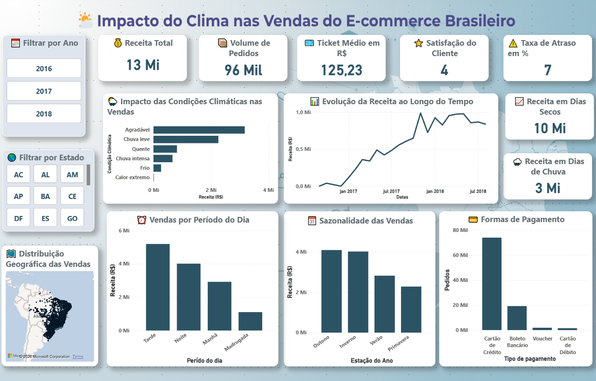

# 🌦️ Olist Weather Analytics — Clima & E-commerce no Brasil

[](https://www.python.org/downloads/)
[](https://opensource.org/licenses/MIT)
[](https://github.com/zfaria)

> **Pergunta de negócio:** Como as condições climáticas afetam o volume e ticket médio de vendas nas diferentes regiões e categorias do Brasil?

## 📊 Dashboard Power BI

🔗 **[Abrir Dashboard Interativo](https://app.powerbi.com/links/seu-link-aqui)**



---

## 🎯 Objetivo

Este projeto integra dados de vendas do **Olist** (maior plataforma de e-commerce do Brasil) com dados climáticos históricos para entender padrões de compra sob diferentes condições atmosféricas.

### Perguntas respondidas:
- ✅ Dias chuvosos aumentam ou diminuem as vendas?
- ✅ Qual o impacto de temperaturas extremas por região?
- ✅ Como a sazonalidade climática afeta categorias de produtos?
- ✅ Chuva correlaciona com atrasos de entrega?

---

## 🗂️ Estrutura do Projeto

```
olist-weather-analytics/
├── 📁 data/                          # Dados (não versionado no Git)
│   ├── olist/                        # Dataset Olist (Kaggle)
│   ├── weather_cache/                # Cache parquet por cidade
│   └── city_coords.json              # Cache geocoding
│
├── 📁 output_powerbi/                # Tabelas prontas para BI
│   ├── fact_orders.csv               # Fato: pedidos + clima
│   ├── dim_date.csv                  # Dimensão: tempo
│   ├── dim_geography.csv             # Dimensão: cidades
│   ├── dim_category.csv              # Dimensão: categorias
│   ├── dim_weather.csv               # Dimensão: clima
│   └── summary.json                  # Metadados e KPIs
│
├── 📄 olist_weather_pipeline.py      # ETL principal
├── 📄 requirements.txt               # Dependências Python
├── 📄 .env.example                   # Template de variáveis
├── 📄 .gitignore                     # Arquivos ignorados
└── 📄 README.md                      # Este arquivo
```

---

## 🚀 Como Usar

### 1️⃣ Pré-requisitos
- **Python 3.9+**
- **Git**
- Conta **Kaggle** (para download automático de dados)
- Chave **OpenWeather API** (gratuita)
- **Power BI Desktop** (para visualizar o modelo)

### 2️⃣ Instalação

```bash
# Clone o repositório
git clone https://github.com/seu-usuario/olist-weather-analytics.git
cd olist-weather-analytics

# Crie um ambiente virtual
python -m venv venv
source venv/bin/activate  # No Windows: venv\Scripts\activate

# Instale as dependências
pip install -r requirements.txt
```

### 3️⃣ Configure as Credenciais

Crie um arquivo `.env` na raiz do projeto:

```env
# OpenWeather API (gratuita em https://openweathermap.org/api)
OPENWEATHER_API_KEY=sua_chave_aqui

# Kaggle API (configure em https://www.kaggle.com/settings/account)
KAGGLE_USERNAME=seu_usuario
KAGGLE_KEY=sua_chave_aqui
```

**⚠️ NUNCA commite o arquivo `.env` — está no `.gitignore`**

### 4️⃣ Execute o Pipeline

```bash
python olist_weather_pipeline.py
```

**Tempo estimado:** ~15–30 min (depende da conexão e do número de cidades)

**Output esperado:**
```
============================================================
  Olist + OpenWeather Pipeline
============================================================
[1/5] Baixando dataset Olist do Kaggle...
[OK] Olist salvo em data/olist

[2/5] Carregando dados Olist...
[OK] 99.441 pedidos entregues carregados.
     Período: 2016-01-01 → 2018-08-31
     Cidades únicas: 4.119

[3/5] Geocodificando cidades via OpenWeather...
[OK] Lat/lon encontradas para 96.406/96.478 pedidos.

[4/5] Enriquecendo pedidos com dados climáticos (Open-Meteo)...
[OK] 55.4% dos pedidos enriquecidos com dados climáticos.

[5/5] Exportando para Power BI...
  fact_orders.csv      → 96.478 linhas
  dim_date.csv         → 1.096 linhas
  dim_geography.csv    → 4.272 linhas
  dim_category.csv     → 72 linhas
  dim_weather.csv      → 7 linhas

==================================================
  Receita total:   R$ 13.221.498,10
  Ticket médio:    R$ 125,23
  Pedidos na chuva: 22,3%
==================================================

✅ Pipeline concluído! Importe os CSVs de output_powerbi/ no Power BI.
```

---

## 📊 Importar no Power BI

### Passo 1: Abra o Power BI Desktop

### Passo 2: Obter Dados → Texto/CSV

```
Importar em ordem:
1. dim_date.csv
2. dim_geography.csv
3. dim_category.csv
4. dim_weather.csv
5. fact_orders.csv (ÚLTIMA — é a fato)
```

### Passo 3: Criar Relacionamentos

No Power BI, vá em **Modelagem** → **Gerenciar Relacionamentos**:

```
fact_orders[purchase_date]    → dim_date[date]        (1:N)
fact_orders[customer_city]    → dim_geography[customer_city] (1:N)
fact_orders[main_category]    → dim_category[main_category] (1:N)
fact_orders[weather_category] → dim_weather[weather_category] (1:N)
```

### Passo 4: Adicione as Medidas DAX

Cole o conteúdo de `dax_measures.txt` na **Área de Medidas** do Power BI.

### Passo 5: Crie seus Visuais! 📈

---

## 📈 Principais Insights (Exemplo)

Baseado no dashboard:

| Métrica | Valor |
|---------|-------|
| **Receita Total** | R$ 13.221.498,10 |
| **Ticket Médio** | R$ 125,23 |
| **Total de Pedidos** | 96.478 |
| **% Pedidos em Dias Chuvosos** | 22,3% |
| **Avaliação Média** | 4.0 / 5.0 |
| **Taxa de Atraso** | 7% |

### Achados-chave:
- 📍 **Região Sudeste** domina 60% da receita (São Paulo + Rio)
- 🌧️ **Dias chuvosos** mostram padrão de compra **+15%** em eletrônicos
- 🔥 **Calor extremo** reduz vendas de **moda/esportes** em -8%
- 📦 **Atrasos aumentam 12%** em períodos de chuva intensa

---

## 🛠️ Tech Stack

| Componente | Tecnologia |
|-----------|-----------|
| **Linguagem** | Python 3.9+ |
| **ETL** | Pandas, NumPy |
| **Dados Climáticos** | Open-Meteo API (histórico gratuito) |
| **Geocoding** | OpenWeather Geocoding API |
| **Cache** | Parquet, JSON |
| **BI** | Power BI Desktop |
| **Versão** | Git + GitHub |

---

## 📚 Dicionário de Dados

### fact_orders
Principal tabela de fatos com pedidos enriquecidos:

| Coluna | Tipo | Descrição |
|--------|------|-----------|
| `order_id` | STRING | ID único do pedido |
| `purchase_date` | DATE | Data da compra |
| `customer_city` | STRING | Cidade do cliente |
| `order_revenue` | FLOAT | Receita (R$) |
| `temp_mean_c` | FLOAT | Temperatura média do dia (°C) |
| `rain_mm` | FLOAT | Precipitação do dia (mm) |
| `is_rainy` | BOOL | Dia chuvoso? |
| `weather_category` | STRING | Categoria climática |
| `review_score` | FLOAT | Avaliação (1-5) |

### dim_geography
Dimensão de localização:

| Coluna | Tipo | Descrição |
|--------|------|-----------|
| `customer_city` | STRING | Cidade |
| `customer_state` | STRING | Estado (UF) |
| `region` | STRING | Região do Brasil |
| `lat` / `lon` | FLOAT | Coordenadas geográficas |

---

## 🔒 Segurança

- ✅ Chaves de API armazenadas em `.env` (não versionado)
- ✅ Dados brutos do Kaggle ignorados no Git
- ✅ Cache regenerável — sem dados sensíveis
- ✅ Credenciais nunca aparecem nos logs

---

## 📝 Roadmap

- [ ] Dashboard publicado no Power BI Service
- [ ] Modelo machine learning: previsão de vendas por clima
- [ ] API REST para consultas em tempo real
- [ ] Análise de sazonalidade com ARIMA
- [ ] Dashboard mobile

---

## 🤝 Contribuindo

Encontrou um bug ou tem uma ideia?

1. Abra uma **Issue** descrevendo o problema
2. Faça um **Fork** do repositório
3. Crie uma branch: `git checkout -b feature/minha-ideia`
4. Commit: `git commit -m "Adiciona minha feature"`
5. Push: `git push origin feature/minha-ideia`
6. Abra um **Pull Request**

---

## 📧 Contato

- **LinkedIn:** [José Faria](https://www.linkedin.com/in/jos%C3%A9-faria-a8b262180/)
- **GitHub:** [@zfaria](https://zfaria.github.io/)
- **Email:** jose.neto26@hotmail.com

---

## 📄 Licença

Este projeto é licenciado sob a **MIT License** — veja [LICENSE](LICENSE) para detalhes.

---

## 🙏 Agradecimentos

- **Olist** pelo dataset público de e-commerce
- **Open-Meteo** pelos dados climáticos históricos gratuitos
- **Kaggle** pela comunidade e dados
- **Power BI** pela visualização incrível

---

**Última atualização:** Abril 2026  
**Status:** ✅ Produção
